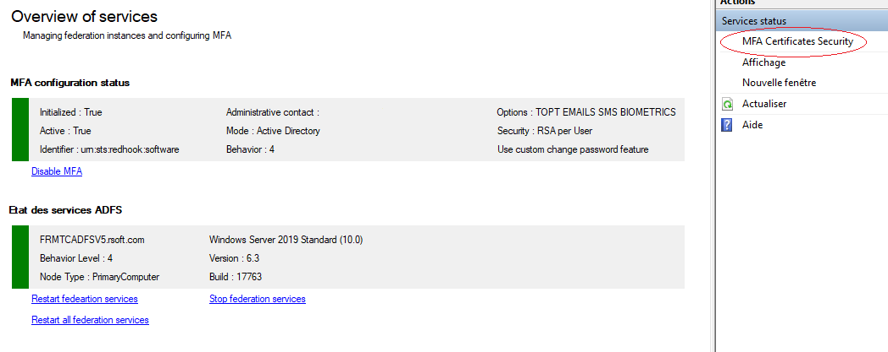

# System Management
When component is registered, you can manage Services with PowerShell or MMC Console.
Some PowerShell Cmdlet are only running on primary servers, and MMC is limited to manage users on secondary servers


## Enable or Disable MFA

>+ Log on a **Primary** Adfs server as **Adfs administrator** or **Delegated administration group** member
>+ Launch a new PowerShell session as administrator
>+ type **get-help Enable-MFASystem –detailed** to get information.
>+ type **get-help Disable-MFASystem –detailed** to get information.
>+ Enter your command
>```powershell
>Enable-MFASystem
>```
>```powershell
>Disable-MFASystem
>```


## Restarting Servers Services

>+ Log on a **Primary** Adfs server as **Adfs administrator** or **Delegated administration group** member
>+ Launch a new PowerShell session as administrator
>+ type **get-help Restart-MFAComputerServices –detailed** to get information.
>+ Enter your command
>```powershell
>Restart-MFAComputerServices -Identity yourserver.fqdn
> ```


## Manage Firewall between ADFS Servers

MFA is using notifications between servers. Notifications are working with a **Secured WCF service** (tcp)
To enable communication between your Adfs servers you must : 

>+ Open tcp ports between servers on firewall's domain zone (port **5987**)
>
>+ Log on a each Adfs server as **Adfs administrator** or **Delegated administration group** member
>
>+ Launch a new PowerShell session as administrator
>
>+ type **get-help Set-MFAFirewallRules –detailed** to get information.
>
>+ Enter your command
>
> ```powershell
> Set-MFAFirewallRules  # using MFA Server list
> ```
> ```powershell
> Set-MFAFirewallRules -ComputersAllowed '172.16.0.1, 172.17.0.50'
> ```
> *Managing firewall rules is only possible with PowerShell (not in MMC)*


## Manage certificates private keys

If you have created MFA certificates (RSA) in previous installations, you must update Access Control List. to give the good rights on the certificates private keys for the Adfs service and the Adfs account 

>+ Log on a each Adfs server as **Adfs administrator** or **Delegated administration group** member
>+ Launch a new PowerShell session as administrator
>+ type **get-help Update-MFACertificatesAccessControlList  –detailed** to get information.
>+ Enter your command
>```powershell
>Update-MFACertificatesAcessControlList
>
>Update-MFACertificatesAcessControlList -CertsKind (AllCerts | MFACerts | ADFSCerts | SSLCerts)
>```
>This cmdlet only add or update ACL, by default all certificates private keys are updated (AllCerts)
>
>Also available in MMC under Service Status Node


## Manage orphaned private keys

We found that on Adfs 2016 and 2019, each time the adfssrv service is restarted, or every 30 minutes. a new "Key/Pair", yes ! a private key is generated in the C:\ProgramData\Microsoft\Crypto\RSA\MachineKeys server directory.
These additional keys are not attached to any certificate or other. Really very strange, it still seems that it is a bug of Adfs interacting with the Framework, that Microsoft really takes time to correct ... 

This problem concerns precisely the key of the SSL certificate.

To avoid ending up with several thousand files in this directory (it's a security problem), you can either use a PowerShell command from time to time or activate a regular cleaning process.

> **Warning !** 
>
> Depending of your configuration, this operation is very intrusive, private keys that not belongs to an installed certificate will be deleted (except the one dedicated to RDP connection).
>
> You must backup your VM or take a snapshot and test before applying this in production.


> - Log on a each Adfs server as **Adfs administrator** or **Delegated administration group** member
>
> - Launch a new PowerShell session as administrator
>
> - type **get-help  Clear-MFAOrphanedRSAKeyPairs  –detailed** to get information.
>
> ```powershell
> Clear-MFAOrphanedRSAKeyPairs
> 
> # Enable automatic garbage every 30 mn
> Clear-MFAOrphanedRSAKeyPairs -AutoCleanUp $true -CleanUpDelay 30
> ```
>
> - Restart the MFA Service with powershell   
>
> ```powershell
> Restart-Service mfanotifhub
> ```


## Managing Services with MMC

>+ Log on the a primary ADFS server  as administrator
>+ Launch MMC snappin

