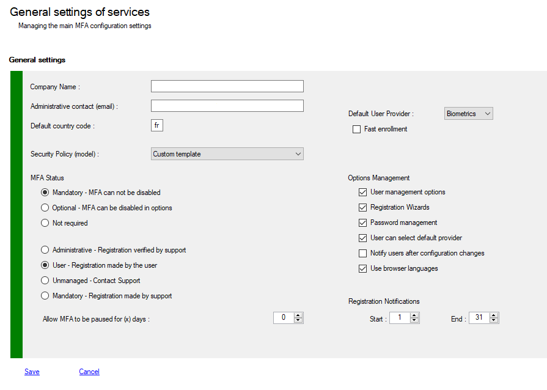

# General Settings
To modify some basic properties of the MFA configuration. As a general rule, the default values propose optimal operation.
Define the mail from the administrative contact, choose ADDS Mode and SQL Mode, set the security policy remain options to which we can not respond by default.

To view your configuration you must use PowerShell applets or the MMC.


## Changing configuration with PowerShell

>+ Log on the a primary Adfs server  as administrator
>+ Launch a new PowerShell session as administrator
>+ type **get-help Get-MFAConfig –detailed** to get information.
>+ type **get-help Set-MFAConfig –detailed** to get information.
>+ Enter your command
>```powershell
>Get-MFAConfig
>```
>```powershell
> $c = Get-MFAConfig
>...
>Set-MFAConfig -Config $c
>```


## General Properties Description

List of all prperties you can access using **Get-MFAConfig** and update with **Set-MFAConfig**

| Properties                               |   Values    | Comments                                                     |
| :--------------------------------------- | :---------: | :----------------------------------------------------------- |
| **Issuer**                               |  specific   | String representing your company (eg : contoso), you must change it. this property is used in email and SMS for example. |
| **AdminContact**                         | valid email | Default administrative email (admin@contoso.com or noreply@contoso.com)<br>You can add a Display Name<br/>- "Display Name <<noreply@contoso.com>>"<br/>- "Display Name [noreply@contoso.com]" |
| **UserFeatures**                         |             | Used to configure how users can register or enable their MFA account, and if users can manage their options alone. Values must be mixed with a binary OR. It’s more simple to use **Set-MFAPolicyTemplate** and use predefined models. Policies models are described later |
| **AdvertisingDays**                      |    1-31     | When users are prompted to register their account for MFA.Specifies the range of days during which a callback is imposed. You can modify FirstDay and LastDay properties |
| **UseOfUserLanguages**                   |    True     | **False**<br>- Use language from the operating system (default .Net localization)<br>**True**<br>- Use language from the browser request at session startup (usefull with new browser versions that overrides default localization : Chrome, Edge Chromium, FireFox) |
| **AllowPauseForDays**                    |      0      | Stop offering MFA for x days (0-90) to the user. 0 = Disabled |
| **CustomUpdatePassword**                 |    True     | Use of our custom “Change password form”, after identification when managing user properties. if No, use of standard Adfs form if your Adfs administrators have enabled required endpoint : /adfs/portal/updatepassword/ |
| **KeepMySelectedOptionOn**               |    True     | Allow users to select their default provider (totp, mail sms, biometrics, etc...) |
| **ChangeNotificationsOn**                |    True     | Send Email notifications after each profile modification if email is set |
| **DefaultCountryCode**                   |  specific   | Country code, usefull when sending SMS                       |
| **DefaultProviderMethod**                |   Choose    | Default  Provider for each new activated user (Choose, Code, Biometric, Email, External, Azure) |
| **LimitEnrollmentToDefaultProvider**     |    False    | Fast Enrollment (initial registration), limited to the selected **DefaultProviderMethod** |
| **UiKind (*)**                           |   Default   | Adfs UI configuration **Default**: Standard UI, **Default2019**: Centered UI (Adfs 2019 only or custom theme) or **Custom**, <br/>it's better to use **Set-MFAThemeMode** cmdlet to change this values. <br>For relying parties (saml/wsfed) themes **Reset-MFAThemesList** cmdlet can be use to force reload for RL themes |
| **AdapterPresentationImplementation(*)** |   string    | Fully Qualified Class overloading **BasePresentation** or **BaseMFAPresentation**<br/>**UIKind** must be set to **Custom** with cmdlet **Set-MFAThemeMode** |
| **UseUIPaginated (*)**                   |    False    | Use of paginated UI introduced with Adfs 2019. it's better to use **Set-MFAThemeMode** cmdlet to change this values |
| **PrimaryAuthenticationOptions** (*)     |    None     | Options available only when MFA is configured as Primary authentication method (ADFS 2019)<br>**None**<br> - No registration process available, External Providers are disabled (E-Mail, Phone, Azure)<br>**Externals**<br>- Allow the usage of External providers at primary authentication level<br>**Register**<br>- Allow registration process for new users |
| **ForcedLanguage (*)**                   |    empty    | Used to force UI localization to a unique country (eg: de,  en, pt, ...) |

*(\*) only available with PowerShell*
### Some Samples
>```powershell
>$c = Get-MFAConfig
>
>$c.AdvertisingDays.FirstDay = 5
>$c.AdvertisingDays.LastDay = 10
>$c.UserFeatures = ([MFA.PSUserFeaturesOptions]::AdministrativeMode -bxor 
>               [MFA.PSUserFeaturesOptions]::AllowEnrollment)
>$c.ReplayLevel = 2
>
>Set-MFAConfig -Config $c
>```


## Changing configuration with MMC Console

>+ Log on the a primary ADFS server  as administrator
>+ Launch MMC snappin




## User Features Policies Templates

Description of the different policies for User Activation.

Policy|Values |Comments
:--------|:------|:--------
**Free**|**BypassDisabled**<br>**BypassUnRegistered**<br>AllowManageOptions<br>AllowChangePassword<br>AllowEnrollment|**When MFA is disabled**<br>- Access is allowed if user is disabled<br>- Access is allowed if user is not registered<br>- Administators only can activate user account<br>**When MFA is enabled**<br>- User can manage password and options<br>- User can use Wizards for enrollment<br>- User can change his default provider<br>- User can disable MFA
**Open**|**BypassDisabled**<br>**AllowUnRegistered**<br>AllowManageOptions<br>AllowChangePassword<br>AllowEnrollment|**When MFA is disabled**<br>- Access is allowed if user is disabled<br>- Access is allowed if user is not registered,<br>- User is asked to register his account (\*)<br>**When MFA is enabled**<br>- User can manage password and options<br>- User can use Wizards for enrollment<br>- User can change his default provider<br>- User can disable MFA
**Default**|**AllowDisabled**<br>**AllowUnRegistered**<br>AllowManageOptions<br>AllowChangePassword<br>AllowEnrollment|**When MFA is disabled**<br>- Access is allowed if user is disabled<br>- User is asked to activate his account (\*)<br>- Access is allowed if user is not registered<br>- User is asked to register his account (\*)<br>**When MFA is enabled**<br>- User can manage password and options<br>- User can use Wizards for enrollment<br>- User can change his default provider<br>- User can disable MFA
**Mixed**|AllowManageOptions<br>AllowChangePassword<br>AllowEnrollment|**When MFA is disabled**<br>- Access denied if user is disabled<br>- Access is denied if user is not registered, User must  register and activate his account<br>**When MFA is enabled**<br>- User can manage password and options<br>- User can use Wizards for enrollment<br>- User can change his default provider
**Managed**|**BypassDisabled**<br>**AllowUnRegistered**<br>**AllowProvideInformations**<br>AllowChangePassword|**When MFA is disabled**<br>- Access is allowed if user  is disabled<br>- Access is allowed if user is not registered<br>- User is asked to send registration request to administrators<br>- Administators only can activate user account<br>**When MFA is enabled**<br>- User can manage password<br>- User can change his default provider
**Strict**|**AdministrativeMode**<br>**AllowProvideInformations**|**When MFA is disabled**<br>- Access is denied if user is disabled<br>- Access is denied if user is not registered<br>- User must send registration request to administrators<br>- Administators only can activate user account<br>**When MFA is enabled**<br>- User can change his default provider
**Administrative**|**AdministrativeMode**|**When MFA is disabled**<br>- Access is denied is user is disabled<br>- Access is denied if user is not registered<br>- Administators only can activate user account.<br>**When MFA is enabled**<br>- Nothing

*(\*) According to the values of **AdvertisingDays** property*


## Changing Web UI Themes

Adfs 2019 introduced the management of several types of user interfaces, aka: Modern Logon UI.
A centered interface and a centered / paginated interface.
adfsmfa supports these new visual types.
Paginated mode is required in Adfs 2019/2022 to position MFA providers as first authentication factor (passwordless)
To switch from the classic interface (2012r2/2016/2019/2022) to the new interface (2019/2022) please respect the following.

Since November 2020 we support themes at Relying Parties level, nothing to do for this. but, if you change some themes or themes properties, you must run the **Reset-MFAThemesList** to force an update reflecting your changes.


>+ Log on the a primary Adfs server  as administrator
>+ Launch a new PowerShell session as administrator
>+ type **get-help Set-MFAThemeMode –detailed** to get information.
>+ Enter your command>
>```powershell
># Set UI to Default (2012r2/2016/2019/2022)
>Set-MFAThemeMode -UIKind Default -Theme MyTheme
>```
>```powershell
># Set UI to Default219 Centred UI (2019/2022)
>Set-MFAThemeMode -UIKind Default2019 -Theme MyTheme2019
>```
>```powershell
># Set UI to Paginated 2019 (2019/2022)
>Set-MFAThemeMode -UIKind Default2019 -Theme MyTheme2019 -Paginated
>```
>```powershell
># Reload al Web themes at relying parties level (saml/wsfed)
>Reset-MFAThemesList
>```
>
>*Changing UI Themes is only available with PowerShell*