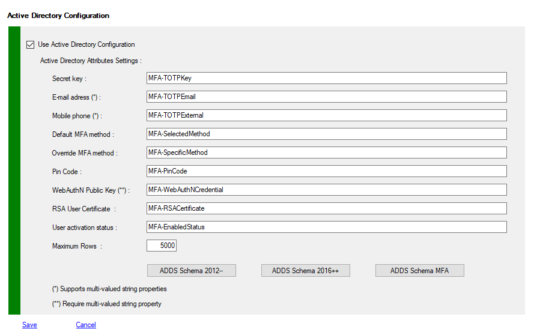
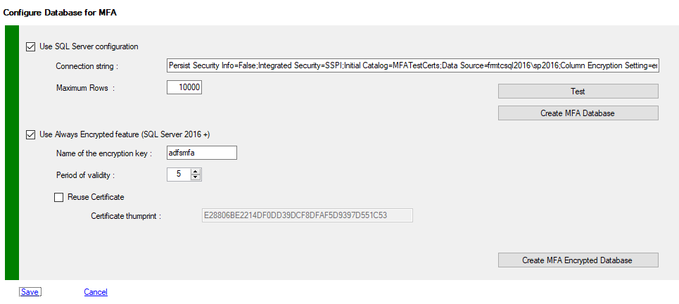
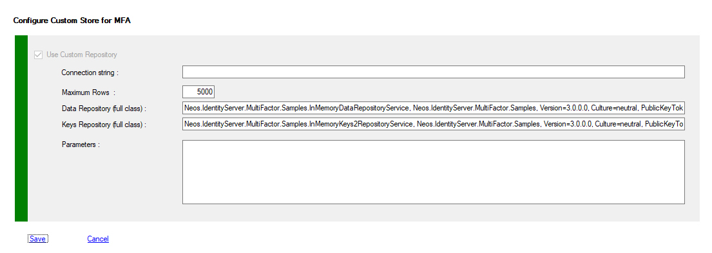

# Managing Data Storage
During the initial configuration of the component, there is a very important configuration parameter to take into account : How to store users metadata ? 
You can decide whether to store users' MFA metadata in **ADDS** attributes or to use **SQLServer** as a repository.
Below are a few items that can help you choose.
<u>The default is to use ADDS as repository</u>

You also have the possibility of implementing your own component allowing to store the information of the users according to your wishes.<BR>The first thing to come to mind is not to use SQL-Server, whose license cost is significant (even under Linux ...), therefore new types of databases, Web services or a security appliance. <BR>For this, you must develop a custom component that you can integrate into the configuration of MFA. <BR>This component must be deployed by you on each adfs server on your farm. <BR>This component should derive from the class provided: **DataRepositoryService**, as well as from the **IWebAuthNDataRepositoryService** interface.
The easiest way is to take inspiration from the standard code (ADDS, SQL) or the example provided **InMemoryDataRepositoryService**, and **InMemoryKeys2RepositoryService**


## Choosing between ADDS mode and SQL Mode

Servers|ADDS|ADDS Comments|SQL|SQL Comments
:---|:---:|:---|:---:|:---
**Single<br> ADFS<br> Server**|Yes|**Pro**<br>- Most simple configuration<br>- No need of external platform.<br>- Data is replicated against All DCs<br>- Can work with any ADDS Schema version<br><br>**Cons**<br>- Data replication can take some time<br>- Not a good practice to write on AD :smiley:<br>- Default config require ADDS Schema 2012|Maybe|**Pro**<br>- Easy to share data with other applications<br>- No replication of data needed<br>- Must be used with “AdfsLocalClaimsProviderTrust” and <br>“AdfsLdapServerConnection” Adfs 2016<br><br>**Cons**<br>- Need of additional platform (SQL-Server).<br>- No replication of data, need backup strategy or Always On replication.<br>- Management is let to DBAs, not to security admins.
**Multiple<br> ADFS<br> Servers**|Yes|**Pro**<br>- Most simple configuration<br>- No need of external platform.<br>- Data is replicated against All DCs<br>- Can work with any ADDS Schema version<br><br>**Cons**<br>- Data replication can take some time<br>- Not a good practice to write on AD :smiley:<br>- Default config require ADDS Schema 2012|Yes|**Pro**<br>- Easy to share data with other applications<br>- No replication of data needed<br>- Must be used with “AdfsLocalClaimsProviderTrust” and <br>“AdfsLdapServerConnection” Adfs 2016<br><br>**Cons**<br>- Need of additional platform (SQL-Server).<br>- No replication of data, need backup strategy.<br>- Management is let to DBAs, not to security admins.<br>- Depending of your network configuration (DMZ or other) access to SQL instance must be granted and secured.
**I want to<br> use RSA/AES<br> security options**|Yes|**Pro**<br>It's a feature|Yes|**Pro**<br>It's a feature
**I want to<br> use RSA<br> security certificates<br>per user**|Yes|**Pro**<br>It's a feature|Yes|**Pro**<br>It's a feature
**Can I use<br>Local Claim Providers Trust<br> to authenticate users stored<br>in LDAP server and use MFA**<br>ADFS 2016+|No|ADFS requirements by design.<br><br>We cannot store users metadata in external LDAP server.|Yes|LDAP users can be registered with MFA when using SQL Mode


## Configuring ADDS Mode

If you have choose to use ADDS, you must verify or modify your ADDS configuration.

To view your configuration you must use PowerShell applets or the MMC.
>+ Log on the a primary Adfs server  as administrator
>+ Launch a new PowerShell session as administrator
>+ type **get-help Get-MFAStore –detailed** to get information.
>+ type **get-help Set-MFAStore –detailed** to get information.
>+ Enter your command
>```powershell
>Get-MFAStore -Store ADDS
>```
>```powershell
> $c = Get-MFAStore -Store ADDS
>...
>Set-MFAStore -Store ADDS -Config $c
>```


### ADDS Properties Description

Property|Default Value|Comments
:---|:---:|:---
**Active**|True|True if ADDS mode is enabled
**KeyAttribute**|msDS-cloudExtensionAttribute10|Attribute used to store the user key (RNG, RSA)
**MailAttribute**| msDS-cloudExtensionAttribute11 |Attribute used to store personal email address<br>Can be a multivalued property
**PhoneAttribute**| msDS-cloudExtensionAttribute12 |Attribute used to store mobile phone number<br>Can be a multivalued property
**MethodAttribute**| msDS-cloudExtensionAttribute13 |Attribute used to store user’s method for MFA (Code, Mail, SMS, Azure, Choose)
**OverrideMethodAttribute**| msDS-cloudExtensionAttribute14 |Attribute used to store user’s specific method for MFA (Code, Mail, SMS, Azure, Choose)
**PinAttribute**| msDS-cloudExtensionAttribute15 |Pin code for user
**PublicKeyCredentialAttribute**|          otherMailbox          |Attribute used to store biometric Public Key Descriptors<br>**MUST be a multivalued user attribute**
**ClientCertificateAttribute**| msDS-cloudExtensionAttribute16 |Attribute used to store Client Certificate (future feature)
**RSACertificateAttribute**| msDS-cloudExtensionAttribute17 |Attribute used to store RSA Certificate when using RSA per user
**EnabledAttribute**| msDS-cloudExtensionAttribute18 |Boolean, specify if the user account for MFA is enabled. Access would be allowed depending of the Policy Template you choose.
**MaxRows**|10000|Maximum rows per LDAP query
**UseSSL**|False|By default, LDAP requests pass in clear on the network, but the authentication phase is secure, the identification informations (credentials) are encrypted (challenge).<BR>You can, if you deploy the appropriate SSL certificates on your domain controllers, the use of LDAPS (port 636) to secure all of the LDAP streams. However port 389 cannot be disabled, this is required for the initialization of the secure connection.


### Sample

>+ Log on the a primary Adfs server  as administrator
>+ Launch a new PowerShell session as administrator
>+ Enter these commands
>```powershell
>$c = Get-MFAStore -Store ADDS
>$c.MailAttribute = "otherMailbox"
>Set-MFAStore -Store ADDS -Config $c
>```


### Selecting an MFA Attributes Template

We support three Templates for attributes description, you change these values according to your needs and respecting the prerequisites.
Using the MFA schema does not depend on the schema level of your ADDS forests, You can have different forests levels.
Remember that a schema modification is irreversible, however the auxiliary class can be deactivated.

>+ Log on the a primary Adfs server  as administrator
>+ Launch a new PowerShell session as administrator
>+ type **get-help  Set-MFAActiveDirectoryTemplate –detailed** to get information.
>+ Enter your command
>```powershell
> Set-MFAActiveDirectoryTemplate -Kind SchemaAll
>or
> Set-MFAActiveDirectoryTemplate -Kind Schema2016
>or
> Set-MFAActiveDirectoryTemplate -Kind SchemaMFA
>```
>


### Deploying the MFA Schema addon for ADDS.

**First ! Backup or take snapshot of your domain controllers !!!**

>Locate the 2 LDF files in _**C:\Program Files\MFA\ADDSTools**_\
>Choose between the confidential version or the standard version (the only difference is the searchFlags set to 0x80 or 0)
>
>Edit selected LDF and replace each occurrence of ",DC=X" with the distinguished name of your domain -> ",DC=mydomain,DC=com"
>
>Copy the modified LDF file on your domain controller
>Deploy the schema extension as domain administrator.

>```
>LDIFDE -i -u -f MFA.MODIFIED.SCHEMA.LDF
>```


### Configuring ADDS Mode with MMC

>+ Log on the a primary Adfs server  as administrator
>+ Launch MMC snappin




## Configuring SQL Mode

If you have choose to use SQL, you must verify or modify your SQL configuration.

To view your configuration you must use PowerShell applets or the MMC.
To Use SQL Mode, you must create a SQL Database on a full SQL Server instance (standard or Enterprise)

>+ Log on the a primary Adfs server  as administrator
>+ Launch a new PowerShell session as administrator
>+ type **get-help Get-MFAStore –detailed** to get information.
>+ type **get-help Set-MFAStore –detailed** to get information.
>+ type **get-help New-MFADatabase -detailed** to get information
>+ Enter your commands
>```powershell
>Get-MFAStore -Store SQL
>```
>```powershell
>$c = Get-MFAStore -Store SQL
>...
>Set-MFAStore -Store SQL -Config $c
>```


### Properties Description

Property|Default Value|Comments
:---|:---:|:---
**Active**|False|True if SQL Mode is Enabled
**ConnectionString**| empty (required) |SQL Server connection string used to connect to the MFA Database created with New-MFADatabase<br>You can use any instance and SQL version must be 2008r2 and Up
**MaxRows**|10000|Maximum rows per SQL query


### SQL Server 2016 Always encrypted columns Properties Description

Property|Default Value|Comments
:---|:---:|:---
**IsAlwaysEncrypted**|False|Database columns (SecretKey, Email, Phone number, PIN) are encrypted by SQL Server
**CertificateValidity**|5|Certificate duration valididy (default 5 years)
**ThumbPrint**|specific|Certificate thumprint (Must be Deployed on all Adfs servers)
**CertReuse**|False|Used if you reuse an existing certificate for SQL Encryption
**KeyName**|adfsmfa|Encryption KeyName (default: adfsmfa)
### Sample
>```powershell
>$c = Get-MFAStore -Store SQL
>$c.Active = $True
>$c.ConnectionString =  "Persist Security Info=False;Integrated Security=SSPI;
>                    Initial Catalog=MFADatabase;Data Source=sqlserver\instance"
>Set-MFAConfigSQL -Store SQL -Config $c
>```


### Configuring SQL Mode with MMC

>+ Log on the a primary Adfs server  as administrator
>+ Launch MMC snappin




### Creating MFA SQL Database with PowerShell

The account under witch you run **New-MFADatabase** Cmdlet must have the SQLServer dbcreator role.
>+ Log on the a primary Adfs server  as administrator
>+ Launch a new PowerShell session as administrator
>+ type **get-help New-MFADatabase -detailed** to get information
>+ Enter your commands
>```powershell
># Using an SQL account for connecting to the MFA Database
>New-MFADatabase -ServerName SQLServer\Instance -DatabaseName MFADatabase 
>                  -UserName sqlaccount -Password pwd
>```
>```powershell
># Using a domain account for connection to the MFA Database
>New-MFADatabase -ServerName SQLServer\Instance -DatabaseName MFADatabase 
>                  -UserName Domain\ADFSaccount
>```
>```powershell
># Using ADFS managed account for connecting to the new MFA Database
>New-MFADatabase -ServerName SQLServer\Instance -DatabaseName MFADatabase
>                 -UserName Domain\ADFSManagedAccount$
>```
>
>Creating a MFA Database with **Always Encrypted Columns** (SQLServer 2016+)
>```powershell
># Using an SQL account for connecting to the MFA Database
>New-MFADatabase -ServerName SQLServer\Instance -DatabaseName MFADatabase 
>                  -UserName sqlaccount -Password pwd -Encrypted
>```
>```powershell
># Using a domain account for connection to the MFA Database
>New-MFADatabase -ServerName SQLServer\Instance -DatabaseName MFADatabase 
>                  -UserName Domain\ADFSaccount -Encrypted
>```
>```powershell
># Using ADFS managed account for connecting to the new MFA Database
>New-MFADatabase -ServerName SQLServer\Instance -DatabaseName MFADatabase
>                 -UserName Domain\ADFSManagedAccount$ -Encrypted
>```
*After creating a MFA Database with encryption, you must export the new certificate with the private key (.pfx), password is blank
And you must deploy this cert on all others ADFS servers*
*To be sure that the ADFS Service Account can access the private key of the new created certificate on others ADFS Servers*
*You must run the PowerShell cmdlet*

>```powershell
>Update-MFACertificatesAccessControlList 
>```


## Configuring Custom Storage Mode

If you have choose to use CUSTOM Storage, you must verify or modify your config.

To view your configuration you must use PowerShell applets or the MMC.
To Use Custom Mode, you must create a .Net component and deploy it on each adfs server (not proxies)<br>One component must derive form **DataRepositoryService**, and implement the **IWebAuthNDataRepositoryService** interface.<BR>And another component must derive from **KeysRepositoryService** for Keys storage

Log on the a primary Adfs server  as administrator

>+ Launch a new PowerShell session as administrator
>+ type **get-help Get-MFAStore –detailed** to get information.
>+ type **get-help Set-MFAStore –detailed** to get information.
>+ Enter your commands
>
>```powershell
>Get-MFAStore -Store CUSTOM
>```
>
>```powershell
>$c = Get-MFAStore -Store CUSTOM
>...
>Set-MFAStore -Store CUSTOM -Config $c
>```


### Properties Description

| Property                                       |  Default Value   | Comments                                                     |
| :--------------------------------------------- | :--------------: | :----------------------------------------------------------- |
| **Active**                                     |      False       | True if Custom Mode is Enabled                               |
| **ConnectionString**                           | empty (required) | Connection string used to connect to your repository         |
| **MaxRows**                                    |      10000       | Maximum rows per SQL query                                   |
| **DataRepositoryFullyQualifiedImplementation** |      string      | Fully Qualified Class implementation for **DataRepositoryService** |
| **KeysRepositoryFullyQualifiedImplementation** |      string      | Fully Qualified Class implementation for **KeysRepositoryService** |
| **Parameters**                                 |      string      | Your custom parameters                                       |

### Configuring Custom Mode with MMC

>+ Log on the a primary Adfs server  as administrator
>+ Launch MMC snappin

