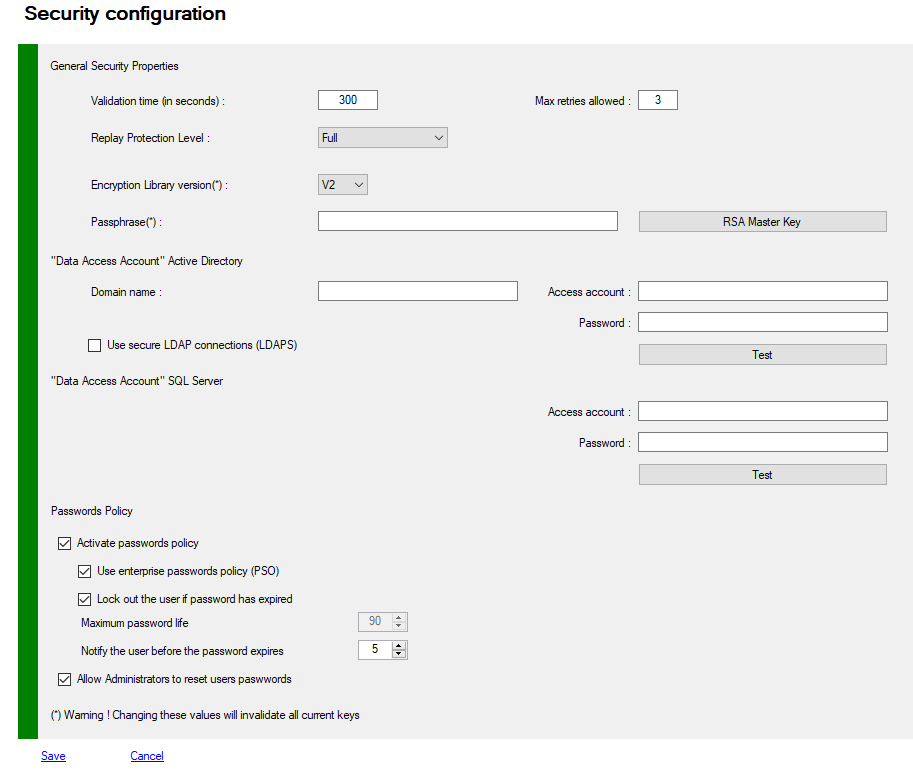
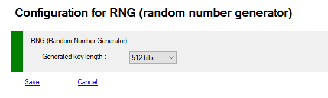
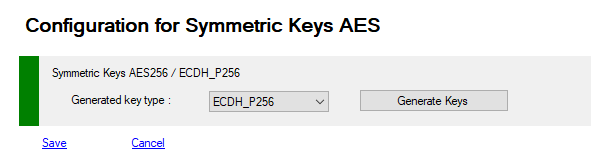
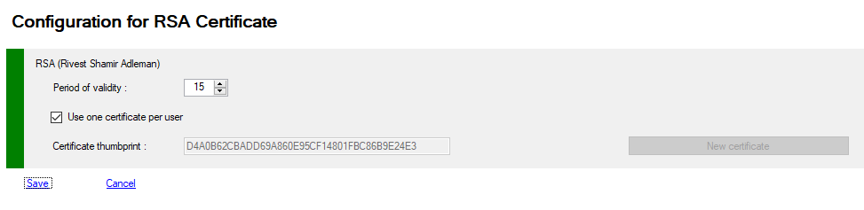
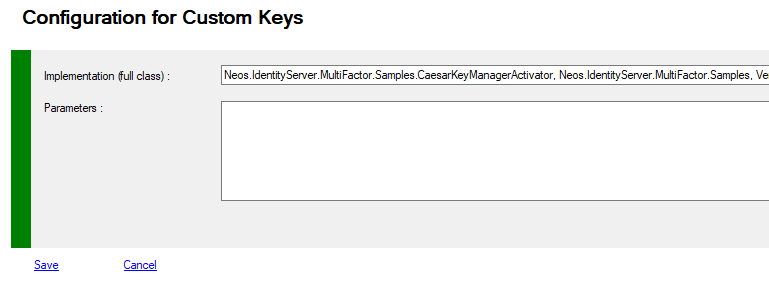
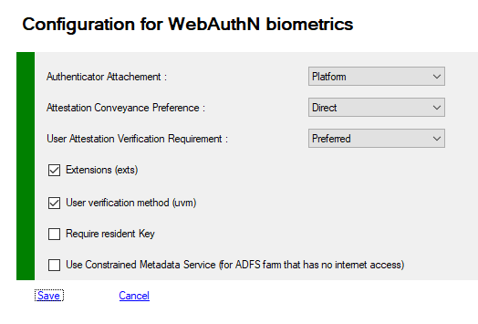
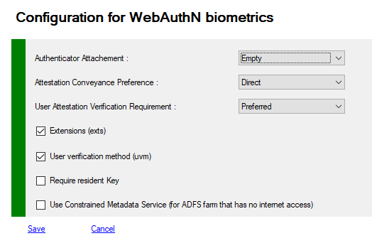

# Security Management

When the component is registered, and you have fixed the storage mode, it's important to configure some security options.

- Number of tries
- Secret Seed
- Super User Credentials 
- Encryption library version
- Protection against Replay


## Changing Security with PowerShell

>+ Log on the a primary Adfs server  as administrator
>+ Launch a new PowerShell session as administrator
>+ type **get-help Get-MFASecurity –detailed** to get information.
>+ type **get-help Set-MFASecurity –detailed** to get information.
>+ Enter your command
>
>```powershell
>Get-MFASecurity
>```
>
>```powershell
>$c = Get-MFASecurity
>...
>Set-MFASecurity $c
>```


# General Security Properties Description

List of all prperties you can access using **Get-MFASecurity** and update with **Set-MFASecurity**

| Properties                             |      Values      | Comments                                                     |
| :------------------------------------- | :--------------: | :----------------------------------------------------------- |
| **DeliveryWindow**                     |       300        | A totp code change every 30 seconds, no network transmission occurs, it’s computed.<br>But for external systems we rely on the transmission of the data like email providers or SMS gateways, the time to distribute the access code to the user is not guaranteed. DeliveryWindow is the maximum time allowed for submitting the totp code. this value is in seconds 300 (5 minutes). |
| **MaxRetries**                         |        3         | Maximum number of identification errors before rejecting the connection |
| **LibVersion**                         |        V2        | Encryption library version<br/>**V1** : All versions before 2.4<br/>**V2** : version 2.4 and upper |
| **ReplayLevel**                        |     Disabled     | - **Disabled** : No replay detection<br>- **Full** : replay detection enabled<br>- **Intermediate** : replay detection enabled except from the same ip address (useful for developers) |
| **XORSecret**                          |      string      | Your secret key for XOR operations<br>default = ABCDEFGHIJKLMNOPQRSTUVWXYZ1234567890<br>this value is encrypted in config file with **AES256 or RSA** |
| **AdministrationPinEnabled(1)**        |      False       | Enable or not Administration PIN feature                     |
| **AdministrationPin(1)**               |       1230       | Default PIN value for configuration updates (asked just one time per session) |
| **PinLength(1)**                       |        4         | PIN length when using pin (activation on each provider) **must be between 4 and 9 digits** |
| **DefaultPin(1)**                      |       1234       | Default PIN value                                            |
| **UseSSL**                             |      False       | - **False** ADDS Request made with **ldap** (ldap://domain:389)<BR>- **True** ADDS Requests made with **ldaps** (ldap://domain:636)<BR>      You must deploy SSL certificates on all your domain controllers |
|                                        |                  |                                                              |
|                                        |                  | **ADDS Data Access Account**                                 |
| **DomainAddress**                      | empty (optional) | domain address in fqdn format -> mydomain.com                |
| **Account**                            | empty (optional) | All request to ADDS are made under ADFS Service Account.<br> If you have authentication problems, you can specify the **ADDS Data Access** user account to access ADDS forests.<br/>**domain\account** is the required format<br>or<br>**domain\account$** for managed service account<br/>You must specify this account if you want to use PowerShell Remoting with MFA Cmdlets. |
| **Password**                           | empty (optional) | Password used with **ADDS Data Access** account<br>this value is encrypted in config file with AES256 or RSA |
|                                        |                  |                                                              |
|                                        |                  | **SQL Server Data Access Account**                           |
| **SQLAccount**                         | empty (optional) | All request to SQL are made under ADFS Service Account. or interactive user<br/> If you have authentication problems, you can specify the **SQL Data Access** user account to access SQL Database.<br/>**SQL Server Account is required** , Not a windows user<br/>You must specify this account if you want to use PowerShell Remoting with MFA Cmdlets. |
| **SQLPassword**                        | empty (optional) | Password used with **SQL Data Access** account<br/>this value is encrypted in config file with AES256 or RSA |
|                                        |                  |                                                              |
|                                        |                  | **Passwords Policy**                                         |
| **UsePasswordPolicy**                  |      False       | - **False** No passwords restrictions<BR>- **True** Activate Passwords Policy Feature |
| **UsePSOPasswordPolicy**               |      False       | - **False** Not using ADDS passwords settings<BR>- **True** Activate ADDS Passwords Policy Settings Feature (Default Password Policy Settings / Fine-Grained Passwords Policies Settings)<br/>See : [Password Policies \| Microsoft Docs](https://docs.microsoft.com/en-us/previous-versions/windows/it-pro/windows-server-2008-r2-and-2008/dd378968(v=ws.10)) |
| **LockUserOnPasswordExpiration**       |      False       | Lock the user, if password is expired                        |
| **MaxPasswordAgeInDays**               |        90        | Maximum password age in days                                 |
| **WarnPasswordExpirationBeforeInDays** |        14        | Warning for users, number of days before expiration of user's password |
| **AllowPasswordsReset**                |      False       | Allow Administrators to reset users passwords in MMC</br>Subject to domain Password Policy, not applicable if passwords never expires |

*(1) Only available with PowerShell*


## Managing MFA Security with MMC

>+ Log on the a primary ADFS server  as administrator
>+ Launch MMC snappin



------


# RNG Security Properties Description

List of all prperties you can access using **Get-MFASecurity -Kind RNG** and update with **Set-MFASecurity -Kind RNG**

RNG are the simplest method to generate a random key for each user, these keys are only encrypted with the security XORKey property, these keys are stored with other metadata in ADDS attribute or in SQL database.

| Properties       |     Values      | Comments                                                     |
| :--------------- | :-------------: | :----------------------------------------------------------- |
| **KeyGenerator** | ClientSecret512 | Key length for **RNG** generator<br/>**Guid**<br/>**ClientSecret128**<br/>**ClientSecret256**<br/>**ClientSecret384**<br/>**ClientSecret512**. |


## Managing RNG Security with MMC

>+ Log on the a primary ADFS server  as administrator
>+ Launch MMC snappin



------

# AES Security Properties Description

List of all properties you can access using **Get-MFASecurity -Kind AES** and update with **Set-MFASecurity -Kind AES**

AES256 is a strong and secure symmetric encryption method to generate a random key for each user, these keys are only encrypted with the security XORKey property, these keys are stored with other metadata in ADDS attribute or in SQL database.

| Properties          | Default Values | Comments                                                     |
| :------------------ | :------------: | :----------------------------------------------------------- |
| **AESKeyGenerator** |     AES256     | Key for **AES** generator<br/><br/>**AES256**<br/>**ECDH_P256** |


## Managing AES Security with MMC

>+ Log on the a primary ADFS server  as administrator
>+ Launch MMC snappin



------

# RSA Security Properties Description

List of all prperties you can access using **Get-MFASecurity -Kind RSA** and update with **Set-MFASecurity -Kind RSA**

RSA are the strongest method to generate a key for each user based on certificate(s), these keys are encrypted and decrypted with asymetric keys of 2048 bits length. and then encrypted with the security XORKey property, these keys are stored with other metadata in ADDS attribute or in SQL database.

| Properties                | Values | Comments                                                     |
| :------------------------ | :----: | :----------------------------------------------------------- |
| **CertificateValidity**   |   5    | Certificate duration in years used in **RSA** and **CUSTOM** modes when generating a cetificate |
| **CertificatePerUser**    |  true  | Generate a certificate per user or one RSA certificate for all users |
| **CertificateThumbprint** | string | Certificate thumbprint when **CertificatePerUser** is **False**. |

If **CertificatePerUser** is **True**, no more configuration is needed. Each user certificate is stored in the users metadata.

If **CertificatePerUser** is **False**,  the generated certificate must be exported on all others Adfs servers. 

On each Adfs server you must run the cmdlet **Update-MFACertificatesAccessControlList**


## Managing RSA Security with MMC

>+ Log on the a primary ADFS server  as administrator
>+ Launch MMC snappin



------

# Custom Security Properties Description

List of all properties you can access using **Get-MFASecurity -Kind Custom** and update with **Set-MFASecurity -Kind Custom**

If the different encryption systems do not suit you or you have specific problems, you can develop your own encryption solution.<br>You must develop a component that implements the **ISecretKeyManager** interface and optionally the **ISecretKeyManagerActivator** interface.<br>See the example: Caesar's code

| Properties                             | Default Values | Comments                                                     |
| :------------------------------------- | :------------: | :----------------------------------------------------------- |
| **CustomFullyQualifiedImplementation** |     string     | Fully Qualified Class implementation for **ISecretKeyManager** and **ISecretKeyManagerActivator** interfaces |
| **CustomParameters**                   |     string     | You custom parameters                                        |


## Managing Custom Security with MMC

>+ Log on the a primary ADFS server  as administrator
>+ Launch MMC snappin




------

# BIOMETRICS Security Properties Description

List of all prperties you can access using **Get-MFASecurity -Kind BIOMETRIC** and update with **Set-MFASecurity -Kind BIOMETRIC**

[WebAuthn](https://www.w3.org/TR/webauthn/) / [FIDO2](https://fidoalliance.org/fido2/) is a new open authentication standard, supported by [browsers](https://www.w3.org/Consortium/Member/List) and [many large tech companies](https://fidoalliance.org/members/) such as Microsoft, Google etc. 

The main driver is to allow a user to login without passwords, creating *passwordless flows* or strong MFA for user signup/login on websites. 

The standard is not limited to web applications with support coming to Active Directory and native apps. The technology builds on public/private keys, allowing authentication to happen without sharing a secret between the user & platform. 

This brings many benefits, such as easier and safer logins and makes phishing attempts extremely hard.


> - Log on the a primary ADFS server as administrator
> - Launch a new PowerShell session as administrator

| Properties                          |  Values   | Comments                                                     |
| :---------------------------------- | :-------: | :----------------------------------------------------------- |
| **AuthenticatorAttachment**         | Platform  | - **Platform**<br>- **Cross-Platform** (NFC, BlueTooth, Security Keys, Yubikeys, ...)<br>https://w3c.github.io/webauthn/#attachment |
| **AttestationConveyancePreference** |  Direct   | - **none**<br>- **direct**<br>- **indirect**<br>https://w3c.github.io/webauthn/#attestation-convey |
| **UserVerificationRequirement**     | Preferred | - **Required**<br>- **Preferred**<br>- **Discouraged**<br>https://w3c.github.io/webauthn/#enumdef-userverificationrequirement. |
| **Extensions**                      |   true    | https://www.w3.org/TR/webauthn/#extensions                   |
| **UserVerificationMethod**          |   true    | https://www.w3.org/TR/webauthn/#sctn-uvm-extension           |
| **RequireResidentKey**              |   false   |                                                              |
| **ConstrainedMetadataRepository**   |   false   | - **False** Metadata Payloads are downloaded automatically from https://mds.fidoalliance.org<br/>- **True** if your adfs's servers don't have access to internet, you must regulary download the blob<br/> and deploy this file on your servers in **\ProgramFiles\MFA\Config** rename the downloaded file as blob.db |

(*) Preview in development and testing

## Managing BIOMETRIC Security with MMC

>+ Log on the a primary ADFS server  as administrator
>+ Launch MMC snappin



> If you want to use a security key (Yubico) with Windows Hello and your phone, you will find a functional configuration below.
>
> - with Windows Hello, the key will be marked as **PACKED** 
> - with your phone (NFC) the key will be marked as **fido-u2f**
>
> In this case, the key will be usable with only one of the 2 devices (otherwise a security error will be generated when recording: same key of two distinct types)
>
> **Sample** but many other solutions are working as well




------

# Create a highly secure configuration


## General Settings

- Choose the adequate User Policy Template : **Mixed**, **Strict** or **Administrative** template are good choices
- Enable custom password management (disable /adfs/portal/updatepassword in adfs endpoints)
- Enable Notifications on configuration changes (email provider must be active)
- Make ADFS Account member of ADFS Admin group
- Remove Local Administrator privileges for the ADFS Account.
- Adjust Rights on Certificates with appropriate cmdlet
- Enable firewall rules between Farm servers
- Enable Password Policy
- Set **Data Access User**  credentials for ADDS and/or for SQL configuration


## Data Storage

- Active Directory : Deploy our **Secure Schema extension** on your domains.
- Active Directory : Use the Super User Account
- SQL Server : Use "Always Encrypted Columns" if you have SQL Server 2016 and Up.

*If you are using the MFA Extension Schema with **CONFIDENTIAL** flags, the account accessing the different ADDS forests (ADFS Account or SuperUser Account) **MUST** have **Read/Write** rights on all Users MFA Properties.*

*With CONFIDENTIAL flag set, this account can be a Domain Admin or a member of the "Account Operators" group for each domain. Account Operators cannot Read or Write Confidential Attributes of Domain Administrators*

------


## Security

- Select **RSA** for keys encryption. and **RSA per user** is better. Or **AES256**
- If you select **RNG**, keysize must be 512 bits
- Enable ReplayLevel : **Full** or **Intermediate**
- Change the **XORKey** with your own. do it at installation, changing XORKey invalidate all stored password and keys 
- Set the library Version to **V2**, only if you have an old config (< version 2.2) set the library to **V1**
- Setup the super  user account 
- Set **DeliveryWindow** to 300 seconds
- Set **MaxRetries** to 3
- Encrypt MFA **passwords** and **XORKey** with an **RSA Key** with **Register-MFASystemMasterKey**
- Use ldaps (if your configuration is ADDS, and if you have deployed the adequate certificates on your domain controllers)

------


## Providers

- Totp Provider : **TOTPShadows** = 2
- Totp Provider : **Algorithm** = SHA512
- Totp Provider : **KeysFormat** = RSA Or AES
- Totp Provider : **KeySize** = 1024 bits or up
- Email Provider : **UseSSL** = true
- Email Provider : do not use **Anonymous**
- Email Provider : **DeliveryNotification** = true
- Biometric Provider : **ChallengeSize** = 32 or up if possible (compatibility with some devices)
- Biometric Security Options : choose defaults
- Biometric Provider : **PinRequirements**    to secure with a pin all unsecure WebAuthN requests