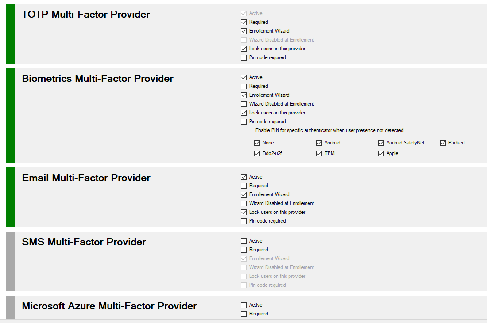

# MFA Providers
One of the main components of this solution are the "MFA Providers".
These components are responsible for presenting, generating and validating the second authentication factor.
There are five types of Providers currently: Code (totp), Biometric, Email, External (see demos), and Microsoft Azure MFA.
In the future, depending on new technologies, new providers may be added to the solution\.

Since version 2.0, all these providers share the same structure and the same functionalities. You can also implement your own "External" Providers.
Since version 2.3, you can replace all default Providers with your own implementations. we will detail these opportunities in the chapter dedicated to development.


## MFA Providers Types

+ #### **Code**

Default provider for OTP (One Time Password) as defined by IETF in rfc4226 and rfc6238
<https://tools.ietf.org/html/rfc6238>\
Key size range are from 128 bits to 2048 bits, and Hash mode ranges are from SHA1 to SHA512

> *An ephemeral code is calculated from a digital key specific tor each user.
> Google generates a unique 80-bit secret digital key for each user.
> This key is transmitted as a 16-character string at base 32 or via a QR code.
> The mobile application will calculate at each connection an HMAC-SHA1 digital signature based on this fixed key, by encoding the number of 30-second periods elapsed since the Unix epoch.
> Part of this signature is taken and converted into a 6-digit number displayed by the application and that the user must copy on the website, in addition to his password.*


+ #### **Email**

Default provider for Email messages
A random computed code (RNG) of 6 digits is sent to the user with an email
The user must enter this code in the ADFS page, in addition to his password.


+ #### **External**

The provider type "External" does not exist ...
Only a plug blocks the use of this provider.
If you have specific needs, have any appliance or want to implement a new model, it is obviously on this side that must look.
Yes, you will develop a component ! GitHub is a basic source code management platform.

We provide several examples, and most importantly, we have already implemented for our customers several specific extensions such as SMS and Hardware tokens appliances gateways.

Some Stargazers like <b>@k-korn, @astound-ts</b> have implemented these features.

Examples are provided to you, certainly they must be improved ...

We will see this in the "development" part, but know that there are 2 interfaces available for your implementations (IExternalOTPPovider (deprecated) and IExternalProvider).
if you build something interesting or useful, post it as a pull request, we will then be happy to integrate in adfsmfa.

<b>External Providers Samples List </b>

+ **Quiz Provider Sample**
  A full implementation of IExternalProvider
> *Neos.IdentityServer.MultiFactor.Samples.QuizProviderSample, Neos.IdentityServer.MultiFactor.Samples, Version=2.5.0.0, Culture=neutral, PublicKeyToken=175aa5ee756d2aa2*

+ **Azure SMS Provider Sample**
  A full implementation of IExternalProvider

> *Neos.IdentityServer.Multifactor.SMS.NeosSMSProvider,Neos.IdentityServer.MultiFactor.SMS.Azure, Version=2.5.0.0, Culture=neutral, PublicKeyToken=175aa5ee756d2aa2*

+ **An implementation of legacy interface IExternalOTPProvider**

> *Neos.IdentityServer.MultiFactor.SMS.SMSCall, Neos.IdentityServer.MultiFactor.SMS.Samples, Version=2.5.0.0, Culture=neutral, PublicKeyToken=175aa5ee756d2aa2*

This was the first sample running with Microsoft Azure (PhoneFactors) at the beginning of 2010's.


+ #### **Azure**

This is an implementation of the new model of Microsoft Azure, integrated with Adfs 2016 and upper.
You now need a subscription with a specific option: https://azure.microsoft.com/en-us/pricing/details/active-directory/ 
Our solution does not bring any additional functionality. Azure MFA is just an additional provider for adfsmfa.
You can have no worries, using the Microsoft MFA integrated in Windows 2016 or 2019 alone or parallel, or ours.
The registration procedure is the same.

>    *However, you should know, this is available in our source code, that you will use an external provider for all MFA operations (even for TOTP). The Web Service (WCF OAuth / ADAL / MSAL) that manages the MFA at Microsoft is located in Redmond:* https://adnotifications.windowsazure.com/StrongAuthenticationService.svc/Connector


+ #### **Biometrics (WebAuthN / FIDO2)**

[WebAuthn](https://www.w3.org/TR/webauthn/) / [FIDO2](https://fidoalliance.org/fido2/) is a new open authentication standard, supported by [browsers](https://www.w3.org/Consortium/Member/List) and [many large tech companies](https://fidoalliance.org/members/) such as Microsoft, Google etc. 

The main driver is to allow a user to login without passwords, creating *passwordless flows* or strong MFA for user signup/login on websites. 

The standard is not limited to web applications with support coming to Active Directory and native apps. The technology builds on public/private keys, allowing authentication to happen without sharing a secret between the user & platform. 

This brings many benefits, such as easier and safer logins and makes phishing attempts extremely hard.


> *based on this project : <https://github.com/abergs/fido2-net-lib>*


## Managing MFA Providers

You can view or modify your Provider configuration.

To view your configuration you must use PowerShell applets or the MMC.
>+ Log on the a primary ADFS server  as administrator
>+ Launch a new PowerShell session as administrator
>+ type **get-help Get-MFAProvider –detailed** to get information.
>+ type **get-help Set-MFAProvider –detailed** to get information.
>+ Enter your command
>```powershell
>Get-MFAProvider -ProviderType Code
>```
>```powershell
> $c = Get-MFAProvider -ProviderType email
>...
>Set-MFAProvider -ProviderType email -Data $c
>```


## Common MFA Provider Properties

Property|Value|Comments
:---|:---:|:---
**Enabled**|True|Does the provider is accessible to users
**IsRequired**|True|Does the user can not provide the required information and not use this provider
**EnrollWizard**|True/False|Does the provider supports Wizards, and Wizard is accessible to users
**EnrollWizardDisabled**|True/False|At registration, if the provider is not required, you can bypass the the wizard.
**LockUserOnDefaultProvider**|False|Lock each user to **his** Default Provider Method<br>- **False** : User can use all providers activated<br>- **True** : User can use his default provider + All Unlocked providers activated if one
**ForceWizard(1)**|Disabled|Values can be **Disabled**, **Enabled**, **Strict**<br>When a user select "I do not have the code". After successful authentication, if enabled or strict, the user MUST execute the wizard to register all the required properties<br>If **Strict** the user cannot cancel the operation
**PinRequired**|False|Does MFA require an additional code PIN
**FullQualifiedImplementation(1)**|string|If you want to replace default provider with your own solution, you must specify the Full Qualified replacement Class<br>This implementation MUST implement IExternalProvider interface or IExternalOTPProvider legacy interface
**Parameters**(1)|string|Configuration parameters passed to the component

*(1) Only available with PowerShell*


## Managing MFA Providers With MMC

>+ Log on the a primary ADFS server  as administrator
>+ Launch MMC snappin




