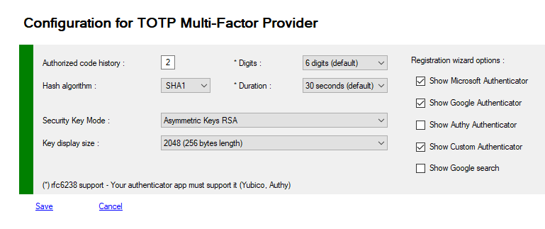

# MFA TOTP Provider
The Provider of type "TOTP" is based on the implementation of the rfc of IETF rfc4226 and rfc6238.
><https://tools.ietf.org/html/rfc6238>
>
Google's initial project only supports some of the features that are emitted, for example the hash algorithm is limited to SHA1,
the digit number of the code is 6, and the code renewal time is every 30 seconds.
The key is 128 bits, of which only 80 will be used to generate the QRCode.

To remain compatible with the different Applications available in different Stores, we respect these choices.
However, the hash level can be up to 512 bits, and the keys can range from 128 to 2048 bits (RSA cert).
Some applications like Authy are able to handle a hash or more complex keys.
This provider is now replaceable by your own implementation, for example to generate 8-digit code every minute. you can easily manage hardware tokens, and dongles


## Managing MFA TOTP Provider

You can view or modify your Provider configuration.

To view your configuration you must use PowerShell applets or the MMC.
>+ Log on the a primary ADFS server  as administrator
>+ Launch a new PowerShell session as administrator
>+ type **get-help Get-MFAProvider –detailed** to get information.
>+ type **get-help Set-MFAProvider –detailed** to get information.
>+ Enter your command
>```powershell
>Get-MFAProvider -ProviderType Code
>```
>```powershell
> $c = Get-MFAProvider -ProviderType Code
>...
>Set-MFAProvider -ProviderType Code $c
>```


## MFA TOTP Provider Properties

| Property                                 |   Value    | Comments                                                     |
| :--------------------------------------- | :--------: | ------------------------------------------------------------ |
| **Enabled**                              |    True    | Does the provider is accessible to users                     |
| **EnrollWizard**                         | True/False | Does the provider supports Wizards, and Wizard is accessible to users |
| **EnrollWizardDisabled**                 | True/False | At registration, if the provider is not required, you can bypass the the wizard. |
| **ForceWizard(1)**                       |  Disabled  | Values can be **Disabled**, **Enabled**, **Strict**<br>When a user select "I do not have the code". After successfull authentication, if enabled or strict, the user MUST execute the wizard to register all the required properties<br>If **Strict** the user cannot cancel the opération |
| **PinRequired**                          |   False    | Does MFA require an additional code PIN                      |
|                                          |            |                                                              |
| **TOTPShadows**                          |     2      | Number of "historic" codes allowed.<br>Sometimes 30 seconds are not enough for a user, in this case the first code displayed will be accepted for 1 minute and 30 seconds |
| **Algorithm**                            |    SHA1    | Hash algorythm used to generate the final Key (QRCode or App)<br>**SHA1**, **SHA256**, **SHA384** and **SHA512**.<br>Authy App is supporting all of these hash modes<br>If you use SHA512 for example, the component will try a "downgrade" in case your OTP Application supports only SHA1 |
| **Digits**                               |     6      | Default = 6<br/> Number of digits for the TOTP code (between 4 and 8).<br/>To be conform to the rfc6238.<br/>You must choose an authenticator application that fully supports this rfc (Authy, Yubico, ...), Microsoft and Google does not fully support this Google's RFC |
| **Duration**                             |     30     | Default = 30<br/>Number of seconds before the code is renewed (between 30 and 180)<br/>To be conform to the rfc6238.<br/>You must choose an authenticator application that fully supports this rfc (Authy, Yubico, ...), Microsoft and Google does not fully support this Google's RFC |
| **KeysFormat**                           |    RNG     | Type of generated Keys for users<br>- **RNG** : Random Number Generator<br>**- AES** : Advanced Encryption Standard <br>- **RSA** : Rivest Shamir Adlerman 2048 bits CNG<br>- **CUSTOM** : Your custom encryption system |
| **KeySize**                              |    1024    | Used to trim the key at a fixed size, when you use RSA the key is very long, and QRCode is perhaps too big for TOTP Application (1024 is a good size, even if RSA key is 2048 bytes long).<br>Possible values are :<br>- **KeySizeDefault** : 1024 bits<br>- **KeySize128** : 128 bits<br>- **KeySize256** : 256 bits<br>- **KeySize384** : 384 bits<br>- **KeySize512** : 512 bits<br>- **KeySize1024** : 1024 bits<br>- **KeySize2048** : 2048 bits |
| **WizardOptions**                        |    All     | **All**, **MicrosoftAuthenticator**, **GoogleAuthenticator**, **AuthyAuthenticator**, **GoogleSearch**, **CustomAuthenticator**<br> Values must be conbined with **-bxor** with PoweShell or **All** (0) |
| **CustomAuthenticatorLogo(1)**           |   string   | Filename only for a file image (60x60 px required), Image must deployed on each Adfs Server in C:\Program Files\MFA\Config\ |
| **CustomAuthenticatorMSStoreLink(1)**    |   string   | Microsoft Store Url for custom authenticator or empty value  |
| **CustomAuthenticatorAppStoreLink(1)**   |   string   | Apple Store Url for custom authenticator or empty value      |
| **CustomAuthenticatorGooglePlayLink(1)** |   string   | Google Play Url for custom authenticator or empty value      |
| **FullQualifiedImplementation(1)**       |   string   | If you want to replace default provider with your own solution, you must specify the Full Qualified replacement class<br>This implementation MUST implement **IExternalProvider** or subclass **BaseExternalProvider** abstract class |
| **Parameters(1)**                        |   string   | Configuration parameters passed to the component             |

(1) Only available with PowerShell

### Example
>```powershell
>$c = Get-MFAProvider -ProviderType code
>$c.WizardOptions = ([MFA.PSOTPWizardOptions]::AuthyAuthenticator
>               -bxor [MFA.PSOTPWizardOptions]::GoogleAuthenticator -bxor [MFA.PSOTPWizardOptions]::CustomAuthenticator)
>$c.Algorithm = [MFA.PSHashMode]::SHA512
>Set-MFAProvider -ProviderType code $c
>```


## Managing MFA OTP Provider with MMC

>+ Log on the a primary ADFS server  as administrator
>+ Launch MMC snappin



