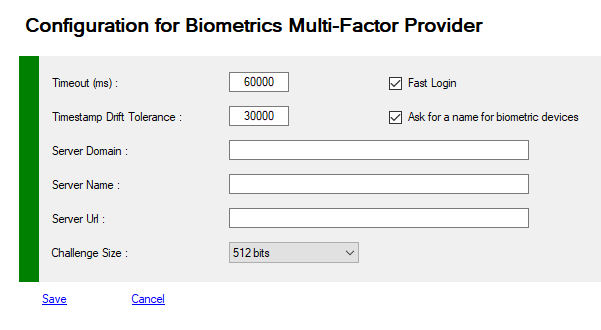

# MFA Biometric Provider
[WebAuthn](https://www.w3.org/TR/webauthn/) / [FIDO2](https://fidoalliance.org/fido2/) is a new open authentication standard, supported by [browsers](https://www.w3.org/Consortium/Member/List) and [many large tech companies](https://fidoalliance.org/members/) such as Microsoft, Google etc. 

The main driver is to allow a user to login without passwords, creating *passwordless flows* or strong MFA for user signup/login on websites. 

The standard is not limited to web applications with support coming to Active Directory and native apps. The technology builds on public/private keys, allowing authentication to happen without sharing a secret between the user & platform. 

This brings many benefits, such as easier and safer logins and makes phishing attempts extremely hard.


## Managing MFA Biometric Provider

You can view or modify your Provider configuration.

To view your configuration you must use PowerShell applets or the MMC.
>+ Log on the a primary Adfs server  as administrator
>+ Launch a new PowerShell session as administrator
>+ type **get-help Get-MFAProvider –detailed** to get information.
>+ type **get-help Set-MFAProvider –detailed** to get information.
>+ Enter your command
>```powershell
>Get-MFAProvider -ProviderType Biometrics
>```
>```powershell
> $c = Get-MFAProvider -ProviderType Biometrics
>...
>Set-MFAProvider -ProviderType Biometrics $c
>```


## MFA Biometric Provider Properties

Property|Value|Comments
:---|:---:|:---
**Enabled**|True|Does the provider is accessible to users
**EnrollWizard**|True/False|Does the provider supports Wizards, and Wizard is accessible to users
**EnrollWizardDisabled**|True/False|At registration, if the provider is not required, you can bypass the the wizard.
**ForceWizard(1)**|Disabled|Values can be **Disabled**, **Enabled**, **Strict**<br>When a user select "I do not have the code". After successfull authentication, if enabled or strict, the user MUST execute the wizard to register all the required properties<br>If **Strict** the user cannot cancel the opération
**PinRequired**|False|Does MFA require an additional code PIN
**PinRequirements**|Null|Allow Pin Requirement for WebAuthN request (User is not verified. examples: no pin for Security Key, no touch for fingerprint device, etc.. )<br> **[Flags]**<br>**Null** = 0<br/>**None** = 1<br/>**AndroidKey** = 2<br/>**AndroidSafetyNet** = 4<br/>**Fido2U2f** = 8<br/>**Packed** = 16<br/>**TPM** = 32<br/>**Apple** = 64
||
**DirectLogin**|True|Launch directly biometric interface. User must cancel to access his configuration options if needed, or choose another authentication mode.
**UseNickNames**|True|if true, registration wizard allows to set a nickname for each device
**Timeout**|60000| Timeout for authenticating in ms<BR> (under Configuration Node) 
 **TimestampDriftTolerance**        |30000|Time difference between server and client in ms (UTC)<br>(under Configuration Node)
**ChallengeSize**|int| Size of the challenge as integer (16, 32, 48, 64 bytes) Equivalent to 128, 256, 384 and 512 bits<BR>(under Configuration Node) 
 **ServerDomain**                   |string|Your public domain (recommended)<br>Sample : contoso.com<br>(under Configuration Node)
**ServerName**|string|Your Adfs Server Name or anything else representing your loadbalanced farm<br>Sample : adfs<br>(under Configuration Node)
**ServerIcon (1)**|string|Url for the farm icon (not implemented)
**Origin (1)**|string|the true Url of your Adfs farm (recommended)<br>Sample : https://sts.contoso.com<br>(under Configuration Node)
||
**ForbiddenBrowsers (1)**|IE;Samsung;Nokia|Browser known to not support WebAuthN (Internet Explorer for example), users will be redirected to choose another connection option.<br>- **Firefox**<br>- **Samsung**<br>- **Nokia**<br>- **Opera**<br>- **IE** (Internet Explorer)<br>- **EdgeLegacy**<br>- **Edge**<br>- **Chrome**<br>- **Safari**<br>- **Unknown**<br><br>**#** before Browser Name disable to option for this browser
**InitiatedBrowsers (1)**|safari;unknown|Especially for Apple devices ...<br/>This option disable "Fast Login" for the session, <br>the user must click a button to initiate the registration/Logon ceremony.<br> https://webkit.org/blog/11312/meet-face-id-and-touch-id-for-the-web/
**NoCounterBrowsers (1)**|safari;unknown|Especially for Apple devices ...<br/>This option disable WebAuthN/FIDO anti-replay feature<br>  https://webkit.org/blog/11312/meet-face-id-and-touch-id-for-the-web/
||
**FullQualifiedImplementation(1)**|string|If you want to replace default email provider with your own solution, you must specify the Full Qualified replacement class<br>You MUST implement **IExternalProvider** or subclass **BaseExternalProvider** abstract class
**Parameters(1)**|string|Configuration parameters passed to the component

(1) Only available with PowerShell


### Example

>```powershell
>$c = Get-MFAProvider -ProviderType Biometrics
>$c.Timeout = 60000
>$c.ChallengeSize = 32
>Set-MFAProvider -ProviderType Biometrics $c
>```


## Managing MFA Biometric Provider with MMC

>+ Log on the a primary ADFS server  as administrator
>+ Launch MMC snappin


