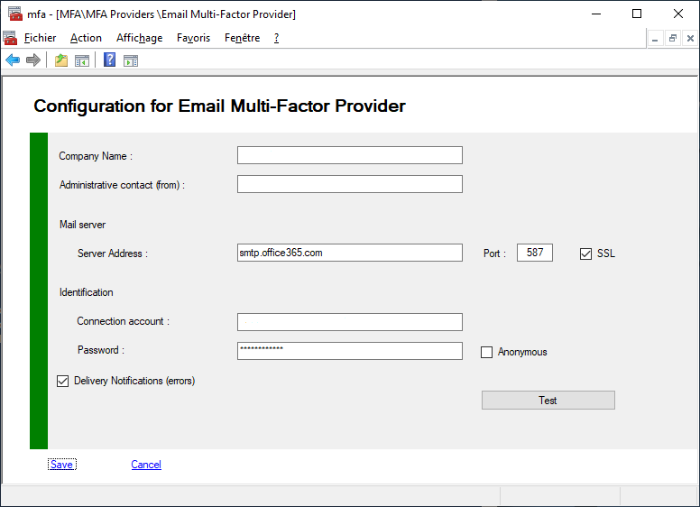

# MFA Email Provider
The Email Provider is used to transmit an ephemeral code calculated by the algorithm RNG (Random Number Generator).
In order for users to access the transmitted email, the email account must not be subject to the use of the MFA.
That's why we will talk about personal email address.

Once the code is sent by email, the user will have 300 seconds (5 minutes) to enter this code on the ADFS page.
The delay can be set in the Security parameters of the MFA


## Managing MFA SMTP Provider

You can view or modify your Provider configuration.

To view your configuration you must use PowerShell applets or the MMC.
>+ Log on the a primary ADFS server  as administrator
>+ Launch a new PowerShell session as administrator
>+ type **get-help Get-MFAProvider –detailed** to get information.
>+ type **get-help Set-MFAProvider –detailed** to get information.
>+ Enter your command
>```powershell
>Get-MFAProvider -ProviderType Email
>```
>```powershell
> $c = Get-MFAProvider -ProviderType Email
>...
>Set-MFAProvider -ProviderType Email $c
>```


## MFA SMTP Provider Properties

Property|Value|Comments
:---|:---:|:---
**Enabled**|True|Does the provider is accessible to users
**EnrollWizard**|True/False|Does the provider supports Wizards, and Wizard is accessible to users
**EnrollWizardDisabled**|True/False|At registration, if the provider is not required, you can bypass the the wizard.
**ForceWizard(1)**|Disabled|Values can be **Disabled**, **Enabled**, **Strict**<br>When a user select "I do not have the code". After successful authentication, if enabled or strict, the user MUST execute the wizard to register all the required properties<br>If **Strict** the user cannot cancel the operation
**PinRequired**|False|Does MFA require an additional code PIN
||
**Company**|string|Name of your company (Contoso Corp),<br>This value will be displayed in the emails transmitted to users
**From**|string|Sender's email account, must be a real account<br>Samples : admin@contoso.com, noreply@contoso.com, secure@contoso.com<br>You can add a Display Name<br>- "Display Name <<noreply@contoso.com>>"<br>- "Display Name [noreply@contoso.com]"
**Host**|string|Your email server hostname or IP<br>Sample : smtp.office365.com
**Port**|int|Your email server port<br>Sample : 587
**UseSSL**|True/False|Does your email server use secure connection
**UserName**|string|Account used to connect and send message from your email server
**Password**|string| Password user with the account<br>this value is encrypted in config file with AES256 or RSA 
 **Anonymous**                      |False|If true no need to specify UserName and Password
**DeliveryNotifications**|True/False|If the provider supports errors notifications, receive an email on error
**AllowedDomains(1)(2)**|object|List of domains only allowed for users<br>Sample : your company domain or sub domains
**BlockedDomains(1)(2)**|object|List of domains not allowed for users<br>Sample : your company domain or exotics domains
**MailOTP(1)(3)**|object|Optional template for email sending totp code
**MailInscription(1)(3)**|object|Optional template for email sending inscription request
**MailSecureKey(1)(3)**|object|Optional template for email sending Secure key
**MailNotifications(1)(3)**|object|Optional template for email sending notification to users after config update
**FullQualifiedImplementation(1)**|string|If you want to replace default email provider with your own solution, you must specify the Full Qualified replacement class<br>You MUST implement **IExternalProvider** or subclass **BaseExternalProvider** abstract class
**Parameters(1)**|string|Configuration parameters passed to the component

(1) Only available with PowerShell
(2) See blocking domains
(3) See replacing default emails


### Example

>```powershell
>$c = Get-MFAProvider -ProviderType Email
>$c.Host = "smtp.office365.com"
>$c.Port = 587
>$c.UseSSL = $True
>$c.From = "noreply@contoso.com
>$c.Company = "contoso corp"
>Set-MFAProvider -ProviderType Email $c
>```


## Allowing Domains

Allow domain names specific to users
>```powershell
>$c = Get-MFAProvider -ProviderType Email
>$c.AllowedDomains.AddDomain("contoso.com")
>$c.AllowedDomains.AddDomain("yahoo.com")
>$c.AllowedDomains.RemoveDomain("microsoft.com")
>Set-MFAProvider -ProviderType Email $c
>```


## Blocking Domains

Prohibit domain names specific to users
>```powershell
>$c = Get-MFAProvider -ProviderType Email
>$c.BlockedDomains.AddDomain("contoso.com")
>$c.BlockedDomains.AddDomain("yahoo.com")
>$c.BlockedDomains.RemoveDomain("microsoft.com")
>Set-MFAProvider -ProviderType Email $c
>```

> **AllowedDomains** and **BlockedDomains** are **exclusive**. If you enter an authorized domain, **BlockedDomains** will be ignored.


## Replacing default emails templates

You must provide an html file as an email template

**For mail templates you must provide some properties**

 - LCID for localization (1033, 1034, 1036, 3082, and more, watch for supported LCIDs)
 - FileName path to html file
 - Enabled Is the template active

>```powershell
>$c = Get-MFAProvider -ProviderType Email
>$c.MailOTP.AddTemplate(1033, "c:\yourpath\yourtemplate.html", $True)
>$c.MailOTP.RemoveTemplate(1036)
>$c.MailOTP.Templates
>Set-MFAProvider -ProviderType Email $c
>```


**Export and register all email templates for a language**

All mail templates for a specific LCID are exported to C:\Program Files\MFA\MailTemplates\{LCID} as html files.

> ```powershell
> Export-MFAMailTemplates -LCID 1033
> Export-MFAMailTemplates -LCID 1036
> Export-MFAMailTemplates -LCID 7
> ```


### Your html files must contains placeholders

#### TOTP Mail
>- {0} Company (string)
>- {1} User Name (string)
>- {2} TOTP Code (string)
>- {3} Mail address (string)
>- {4} QR Code (graphic)  // Something like that in your HTML file 
>
>```html
>
>```
>
>
#### Secure Key Mail
>- {0} Company (string)
>
>- {1} User Name (string)
>
>- {2} Security Key (string)
>
>- {3} QR Code (graphic)  // Something like that in your HTML file 
>
> ```html
> 
> ```
>
>-  {4} Mail address (string)
>-  {5} Company Logo (graphic) // Something like that in your HTML file 
>
>```html
>
>```
>
>
#### Inscription Mail
>- {0} Company (string)
>- {1} User Name (string)
>- {2} Mail address (string)
>- {3} Phone number (string)
>- {4} Preferred MFA method (code, mail, sms, biometrics, azure) (string)
>- {5} Company Logo (graphic) // Something like that in your HTML file 
>
>```html
>
>```
>
>
#### Notification Mail
>- {0} User Name (string)
>- {1} Company (string)
>- {2} Mail address (string)
>- {3} Company Logo (graphic) // Something like that in your HTML file 
>
>```html
>
>```
>
>


## Managing MFA SMTP Provider with MMC

>+ Log on the a primary ADFS server  as administrator
>+ Launch MMC snappin


