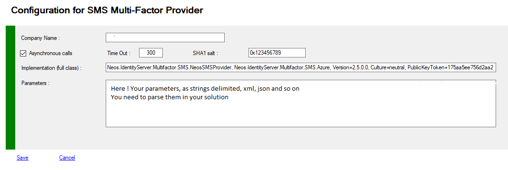

# MFA External Provider
The external provider as no implementation, just some samples.
Initially, we implemented a module working with Azure MFA for mobile notifications,
we also realized modules for our customers working with SMS appliances.
To develop your own component you must implement the ```IExternalProvider``` interface or derive your component from the ```BaseExternalProvider``` abstract class.
The interface ```IExternalOTPProvider``` is much simpler for the implementation, but it is deprecated today.\
These interfaces and the necessary classes are found in the ```Neos.IdentityServer.MultiFactor.Common``` assembly.
More details in chapter "Development".


> Usually, this extension is used for sending SMS or notifications to the user. 
>
> We have developed several solutions of this type for our customers.  
>
> (8 sim cards : "S100 gateway" see : www.iQSim.com)
>
> You can implement whatever you want ... 
>
> Please, look at the "Quiz" example,  which seems a good inspiration...


## Several examples are provided

- **Neos.IdentityServer.MultiFactor.Samples**
  - **QuizProviderSample** a full implementation of ```IExternalProvider```, with one and two way interactions.<br>You must watch at this project if you want to develop your own provider.
  - **NeosOTPProvider430** a full implementation of ```IExternalProvider``` for **TOTP** provider replacement (4 dgits every 30 seconds)

  - **NeosSMSProvider** a full implementation of ```IExternalProvider``` for Azure MFA (old aPI, PhoneFactors)
  - **SMSCall** a legacy implementation of ```IExternalOTPProvider``` for Azure MFA (old api, PhoneFactors)


## Managing MFA External Provider

You can view or modify your Provider configuration.

To view your configuration you must use PowerShell applets or the MMC.
>+ Log on the a primary ADFS server  as administrator
>+ Launch a new PowerShell session as administrator
>+ type **get-help Get-MFAProvider –detailed** to get information.
>+ type **get-help Set-MFAProvider –detailed** to get information.
>+ Enter your command
>```powershell
>Get-MFAProvider -ProviderType External
>```
>```powershell
> $c = Get-MFAProvider -ProviderType External
>...
>Set-MFAProvider -ProviderType External $c
>```


## MFA External Provider Properties

Property|Value|Comments
:---|:---:|:---
**Enabled**|True|Does the provider is accessible to users
**EnrollWizard**|True/False|Does the provider supports Wizards, and Wizard is accessible to users
**EnrollWizardDisabled**|True/False|At registration, if the provider is not required, you can bypass the the wizard.
**ForceWizard(1)**|Disabled|Values can be **Disabled**, **Enabled**, **Strict**<br>When a user select "I do not have the code". After successfull authentication, if enabled or strict, the user MUST execute the wizard to register all the required properties<br>If **Strict** the user cannot cancel the opération
**PinRequired**|False|Does MFA require an additional code PIN
||
**Company**|string|Name of your company (Contoso Corp),<br>This value can be displayed in the messages transmitted to users
**Sha1Salt**|string|a text string, that can be used as a Salt
**IsTwoWay**|boolean|boolean for information if one way or two way mode is available
**Timeout**|int|Information for Timeout
**FullQualifiedImplementation**|string|To enlist your External provider, you must specify the Full Qualified replacement class<br>You MUST implement **IExternalProvider** or subclass **BaseExternalProvider** abstract class
**Parameters**|string|Configuration parameters passed to the component

(1) Only available with PowerShell
### Example
>```powershell
>$c = Get-MFAProvider -ProviderType External
>$c.TimeOut = 300
>$c.IsTwoWay = $True
>$c.Company = "contoso corp"
>$c.FullQualifiedImplementation = "Neos.IdentityServer.MultiFactor.Samples.QuizProviderSample,Neos.IdentityServer.MultiFactor.Samples, Version=3.0.0.0, Culture=neutral, PublicKeyToken=175aa5ee756d2aa2>"
>     $c.Parameters = "My parameters string, value1=1, value2=2
>Set-MFAProvider -ProviderType External $c
>```


## Managing MFA External Provider with MMC

>+ Log on the a primary ADFS server  as administrator
>+ Launch MMC snappin


