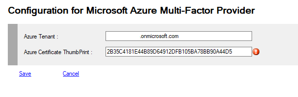

# MFA Microsoft Azure Provider
This is an implementation of the new model of Microsoft Azure, integrated with ADFS 2016 and Up.
>You now need a subscription with a specific option: https://azure.microsoft.com/en-us/pricing/details/active-directory/ 
>Our solution does not bring any additional functionality. Azure MFA is just an additional provider for adfsmfa.
>You can have no worries, using the Microsoft MFA integrated in Windows 2016, 2019 or 2022 alone or parallel, or ours.
>The registration procedure is the same.
>First read this : <https://docs.microsoft.com/en-us/windows-server/identity/ad-fs/operations/configure-ad-fs-and-azure-mfa>


## Registering Azure MFA

To view your configuration you must use PowerShell applets or the MMC.
>+ Log on the a primary ADFS server  as administrator
>+ Launch a new PowerShell session as administrator
>```powershell
>$certbase64 = New-AdfsAzureMfaTenantCertificate -TenantID <tenantID>
>
>New-MsolServicePrincipalCredential -AppPrincipalId 981f26a1-7f43-403b-a875-f8b09b8cd720 -Type asymmetric -Usage verify -Value $certBase64
> 
>Set-AdfsAzureMfaTenant -TenantId <tenant ID> -ClientId 981f26a1-7f43-403b-a875-f8b09b8cd720
>```


## Managing Azure MFA Provider

You can view or modify your Provider configuration.

To view your configuration you must use PowerShell applets or the MMC.
>+ Log on the a primary ADFS server  as administrator
>+ Launch a new PowerShell session as administrator
>+ type **get-help Get-MFAProvider –detailed** to get information.
>+ type **get-help Set-MFAProvider –detailed** to get information.
>+ Enter your command
>```powershell
>Get-MFAProvider -ProviderType Azure
>```
>```powershell
> $c = Get-MFAProvider -ProviderType Azure
>...
>Set-MFAProvider -ProviderType Azure $c
>```


## MFA Azure Provider Properties

Property|Value|Comments
:---|:---:|:---
**Enabled**|True|Does the provider is accessible to users
**EnrollWizard**|False|Does not supports Wizards, a hyper link to the AAD user profile is provided
**EnrollWizardDisabled**|True/False|At registration, if the provider is not required, you can bypass the the wizard.
**ForceWizard(1)**|Disabled|Values can be **Disabled**, **Enabled**, **Strict**<br>When a user select "I do not have the code". After successful authentication, if enabled or strict, the user MUST execute the wizard to register all the required properties<br>If **Strict** the user cannot cancel the operation
**PinRequired**|False|Does MFA require an additional code PIN
||
**TenantId**|string|yourtenant.onmicrosoft.com
**Thumbprint**|FFFFF...0123|ThumbPrint of the certificate used when registering with **Azure MFA**
**FullQualifiedImplementation(1)**|string|If you want to replace this provider with your own solution, you must specify the Full Qualified replacement class<br>This implementation MUST implement **IExternalProvider** or subclass **BaseExternalProvider** abstract class
**Parameters(1)**|string|Configuration parameters passed to the component

(1) Only available with PowerShell

### Example
>```powershell
>$c = Get-MFAProvider -ProviderType Azure
>$c.Tenantid = "yourtenant.onmicrosoft.com"
>$c.ThumbPrint = "FFFFF...0123"
>Set-MFAProvider -ProviderType Azure $c
>```


## Managing Azure MFA Provider with MMC

>+ Log on the a primary Adfs server  as administrator
>+ Launch MMC snappin



