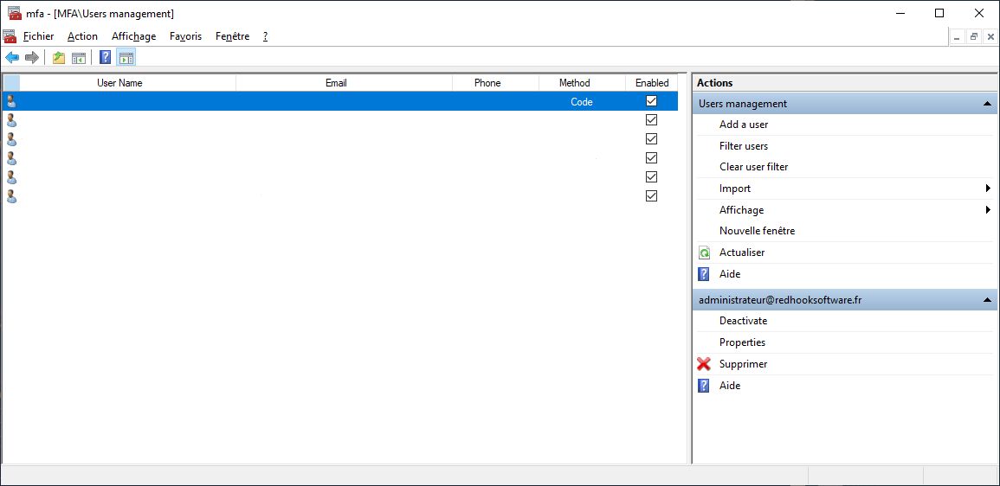

# Users Management

User management, what is it ?
In order to use the MFA, your users must have been registered in the system. as such they must provide you or you must provision some information for authentication 2 factors.
Depending on the configuration of the component (UserFeatures), your users may have to enter the information by their own means (Default Template), or you can do it more administratively by creating the accounts yourself.


## Managing Users

You can view or modify All users properties.

To manage users you must use PowerShell applets or the MMC.
>+ Log on the a primary ADFS server  as administrator
>+ Launch a new PowerShell session as administrator
>+ type **get-help <b>\*MFAU\*</b>** to get information.
>+ Enter your command
>```powershell
>Get-MFAUsers
>```
>```powershell
> $c = Get-MFAUsers
>...
>Set-MFAUsers $c
>```


## Basic management operations (CRUD)

List o PowerShell cmds to Add, Get, Delete or Update users


### Selecting Users

To Select users with PowerShell applets .
>+ Log on the a primary ADFS server  as administrator
>+ Launch a new PowerShell session as administrator
>+ type **get-help Get-MFAUsers -detailed** to get information.
>+ Enter your command
>```powershell
>#----------  EXAMPLE 1  ----------
># Get All active Users
>Get-MFAUsers
>
>#----------  EXAMPLE 2  ----------
># Get All Users
>Get-MFAUsers -IncludeDisabled
>Get-MFAUsers -All
>
>#----------  EXAMPLE 3  ----------
># Get a specific user
>$u = Get-MFAUsers -Identity userprincipal@domain.com
>
>#----------  EXAMPLE 4  ----------
># Get all users registered with MFA whose the upn start with "neos",
>including disabled, display result count.
>
>Get-MFAUsers -FilterValue neos -FilterOperator StartWith -IncludeDisabled -ShowCount
>Get-MFAUsers -Value neos -Operator StartWith -All -ShowCount -SortOrder UserName
>```


### Adding Users

To Add users users with PowerShell applets .
>+ Log on the a primary ADFS server  as administrator
>+ Launch a new PowerShell session as administrator
>+ type **get-help Add-MFAUsers -detailed** to get information.
>+ Enter your command
>```powershell
>#----------  EXAMPLE 1  ----------
># Add all users in collection.
>Add-MFAUsers $users
>
>#----------  EXAMPLE 2  ----------
># Add a specific user.
>Add-MFAUsers -Identity user@domain.com -Email user@mailbox.com
>               -Phone 0606050403 -Method Code
>
>Add-MFAUsers -Identity user@domain.com -Email user@mailbox.com
>               -Phone 0606050403 -PIN 2451 -Method Code -NoNewKey
>
>#----------  EXAMPLE 3  ----------
>Add-MFAUsers $users -Method Code -NoNewKey
>```


### Updating Users

To Update users with PowerShell applets .
>+ Log on the a primary ADFS server  as administrator
>+ Launch a new PowerShell session as administrator
>+ type **get-help Set-MFAUsers -detailed** to get information.
>+ Enter your command
>```powershell
>#----------  EXAMPLE 1  ----------
># Update all users in collection.
>Set-MFAUsers $users
>
>#----------  EXAMPLE 2  ----------
># Update a specific user.
>Set-MFAUsers -Identity user@domain.com -Email user@mailbox.com
>                        -Phone 0606050403 -Method Code
>Set-MFAUsers -Identity user@domain.com -Email user@mailbox.com 
>                        -Phone 0606050403 -PIN 2451 -Method Code -ResetKey
>
>#----------  EXAMPLE 3  ----------
># Update a specific user.
>Set-MFAUsers -Identity user@domain.com -Email "Name <user@mailbox.com>"
>                        -Phone 0606050403 -Method Code
>Set-MFAUsers -Identity user@domain.com -Email "Name [user@mailbox.com]"
>                        -Phone 0606050403 -PIN 2451 -Method Code -ResetKey
>#----------  EXAMPLE 4  ----------
># Update users and reset SecretKey.
>Set-MFAUsers -Identity user@domain.com -ResetKey
>Set-MFAUsers $users -ResetKey
>```


### Removing Users

To Remove users with PowerShell applets .
>+ Log on the a primary ADFS server  as administrator
>+ Launch a new PowerShell session as administrator
>+ type **get-help Remove-MFAUsers -detailed** to get information.
>+ Enter your command
>```powershell
>#----------  EXAMPLE 1  ----------
># remove all users in collection.
>Remove-MFAUsers $users
>
>#----------  EXAMPLE 2  ----------
># Remove a specific user.
>Remove-MFAUsers -Identity user@domain.com
>```


### Enabling/Disabling Users

To Remove users with PowerShell applets .
>+ Log on the a primary ADFS server  as administrator
>+ Launch a new PowerShell session as administrator
>+ type **get-help Enable-MFAUsers -detailed** to get information.
>+ type **get-help Disable-MFAUsers -detailed** to get information.
>+ Enter your command
>```powershell
>#----------  EXAMPLE 1  ----------
># enable all users in collection.
>Enable-MFAUsers $users
>
>#----------  EXAMPLE 2  ----------
># Enable a specific user.
>Enable-MFAUsers -Identity user@domain.com
>
>#----------  EXAMPLE 3  ----------
># Disable all users in collection.
>Disable-MFAUsers $users
>
>#----------  EXAMPLE 4  ----------
># Disable a specific user.
>Disable-MFAUsers -Identity user@domain.com
>```


## Import management operations

PowerShell Import cmdlets


### Importing users with CSV files

You can find a sample CSV file in **C:\Program Files\MFA\import.csv**.
>+ Log on the a primary ADFS server  as administrator
>+ Launch a new PowerShell session as administrator
>+ type **get-help Import-MFAUsersCSV  -detailed** to get information.
>+ Enter your command
>```powershell
>#----------  EXAMPLE 1  ----------
>Import-MFAUsersCSV -LitteralPath c:\temp\import.csv
>
>#----------  EXAMPLE 2  ----------
>Import-MFAUsersCSV -LitteralPath c:\temp\import.csv -DisableAll -SendMail -NewKey
>```


### Importing users with XML files

You can find a sample XML file in **C:\Program Files\MFA\import.xml**.
>+ Log on the a primary ADFS server  as administrator
>+ Launch a new PowerShell session as administrator
>+ type **get-help Import-MFAUsersXML  -detailed** to get information.
>+ Enter your command
>```powershell
>#----------  EXAMPLE 1  ----------
>Import-MFAUsersXML -LitteralPath c:\temp\import.xml
>
>#----------  EXAMPLE 2  ----------
>Import-MFAUsersXML -LitteralPath c:\temp\import.xml -DisableAll -SendMail -NewKey
>```


### Importing users from ADDS

You must provide an ldap path.
>+ Log on the a primary ADFS server  as administrator
>+ Launch a new PowerShell session as administrator
>+ type **get-help Import-MFAUsersADDS  -detailed** to get information.
>+ Enter your command
>```powershell
>#----------  EXAMPLE 1  ----------
>Import-MFAUsersADDS -LDAPPath "dc=domain,dc=com"
>
>#----------  EXAMPLE 2  ----------
>Import-MFAUsersADDS -LDAPPath "dc=domain,dc=com" -DisableAll -SendMail -NewKey
>
>#----------  EXAMPLE 3  ----------
>Import-MFAUsersADDS -LDAPPath "dc=domain,dc=com" -Method Code 
>                             -CreatedSince ([DateTime]::UtcNow.AddHours(-4)) 
>                             -ModifiedSince ([DateTime]::UtcNow.AddMinutes(-30))
>
>#----------  EXAMPLE 4  ----------
>Import-MFAUsersADDS -LDAPPath "dc=domain,dc=com" -Method Code 
>                             -ModifiedSince ([DateTime]::UtcNow.AddMinutes(-30))
>```
You can put this kind of in a PowerShell file and run this script with Windows Task Scheduler

### Removing deleted users from ADDS

>+ Log on the a primary ADFS server  as administrator
>+ Launch a new PowerShell session as administrator
>+ type **get-help CleanUp-MFAUsersADDS  -detailed** to get information.
>+ Enter your command
>
>```powershell
>#----------  EXAMPLE 1  ----------
>CleanUp-MFAUsersADDS
>```
>
>You can put this kind of in a PowerShell file and run this script with Windows Task Scheduler


## Managing Users with MMC

>+ Log on the a primary ADFS server  as administrator
>+ Launch MMC snappin


