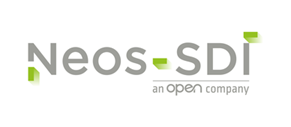

# MFA for Microsoft ADFS 2022 / 2019 / 2016 / 2012r2

**What I Know** (password) and **What I Hold** (device) or **Who I Am** (biometric) are the keys of MFA.

___
## Installation & Documentation (version 3.1)
* [Installation](01-Installation)
* [UnInstallation](02-UnInstallation)
* [Upgrade from previous versions](03-UpgradeFromPrevious)
* [System Configuration and management](04-System%20Management)
* [General Settings management](05-General%20Settings)
* [Storage management](06-Data%20Storage)
* [Security Management](07-Security)
* [Providers](08-MFA%20Providers)
  * [TOTP Provider](08A-MFA%20TOTP%20Provider)
  * [Biometric Provider](08B-MFA%20Biometric%20Provider)
  * [Email Provider](08C-MFA%20Email%20Provider)
  * [External Provider (SMS)](08D-MFA%20External%20Provider)
  * [Microsoft Azure Provider](08E-MFA%20Azure%20Provider)
* [Users management](09-Users%20Management)
* [PowerShell Commands](10-PowerShell%20Commands)
* [Localization](11-Localization)
___
## Development

- [Development Tasks](13-Build)

## Change Log

- [Change Log](12-ChangeLog)

___
## Downloads
* [https://github.com/neos-sdi/adfsmfa/releases](https://github.com/neos-sdi/adfsmfa/releases)
___

## Neos-SDI
Neos-SDI is a global business and technology consulting firm that leads organizations toward innovative growth faster through the identification, application and support of inspired technology solutions. 

By leveraging our unique methodologies, we are able to help our clients envision the unique ways technology can be successfully applied to their business. 

Our envisioning sessions are intended to inspire the use of technology in differentiated ways in order to optimize our client's potential for growth. 

Founded in Paris in 2001, the source of Neos-SDI’s success is attributed to over 150 certified consultants, and 14 gold and two silver Microsoft Partner competencies; making Neos-SDI one of the top 10 Microsoft Partners worldwide.

Feel free to follow our projects on Github

[Multi-Factor Authentication for Microsoft ADFS](https://github.com/neos-sdi/adfsmfa)

[SharePoint Identity Service Application (Claim Provider for SharePoint)](https://github.com/neos-sdi/spidenityservice)